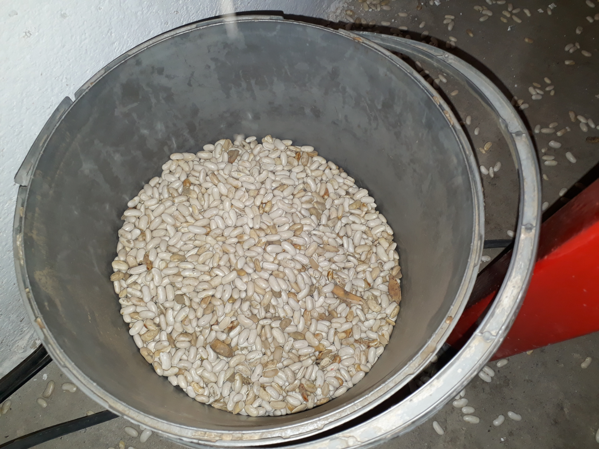

# Seed sorter
Program for sorting bean seeds

Warning: This software is for embedded system (Raspberry Pi 4) use only!
Required packages: libv4l-dev fpc lazarus

How to run first time:

1. make all
2. make Service
3. make walkthrough

Software sends square signal (17Hz) on gpio pin when seed for rejection is in a selected area.

 / 

Photo-galery

