Seed sorter 
===========
as an embedded system based on artificial intelligence
------------------------------------------------------
Program for sorting bean seeds.  
The machine and software were designed and created by Paweł Bielecki (pbielecki2000@gmail.com). 

Warning: This software is for embedded system (Raspberry Pi 4) use only!
Required packages: libv4l-dev fpc lazarus

How to run first time:

1. make all
2. make Service
3. make walkthrough

Software sends square signal (17Hz) on gpio pin when seed for rejection is in a selected area.

 / [Video in FullHD](https://www.mediafire.com/file/zxpubwug0rqqun6/20211218_133223.mp4/file)

Photo-galery

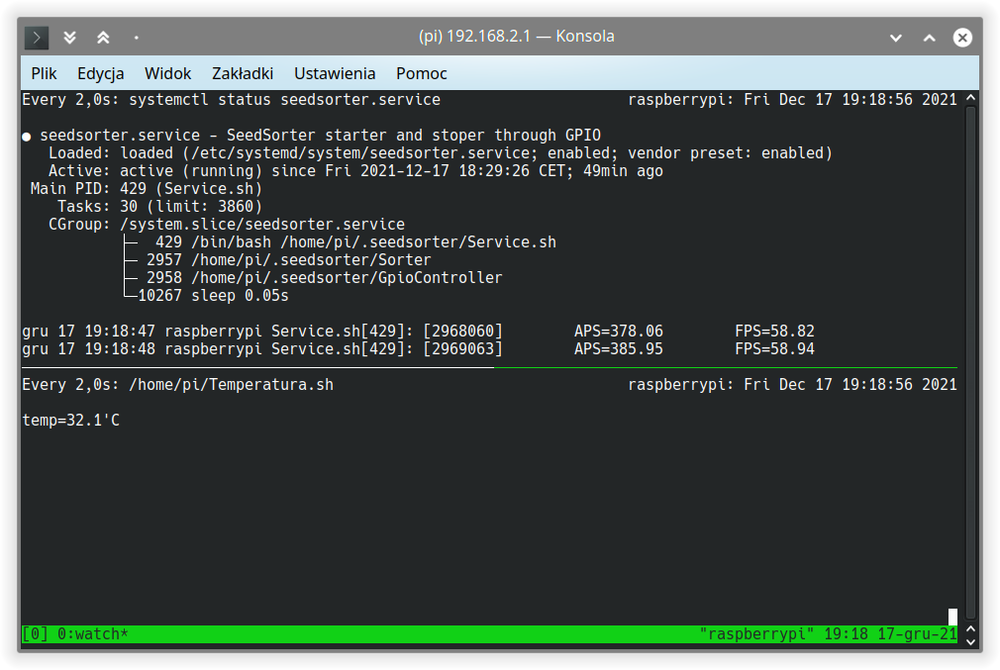
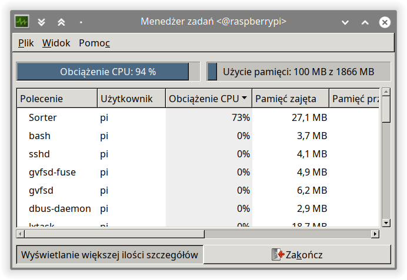

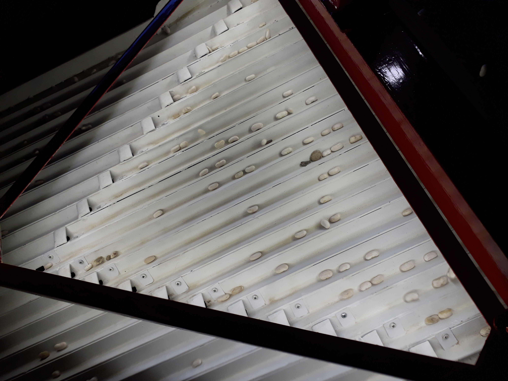

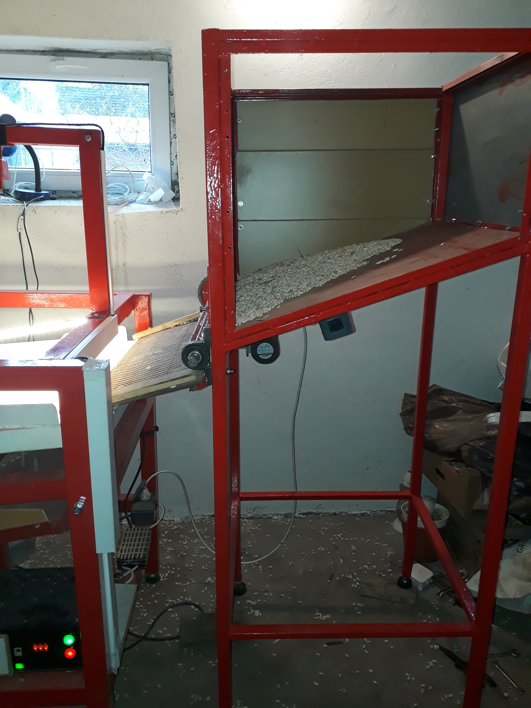
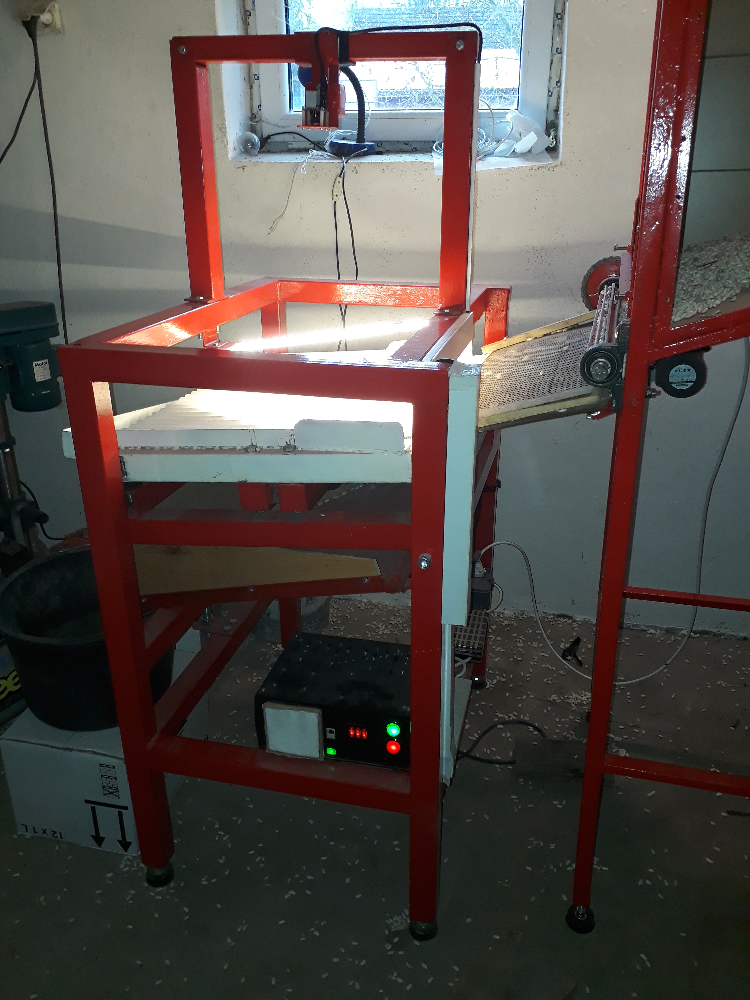

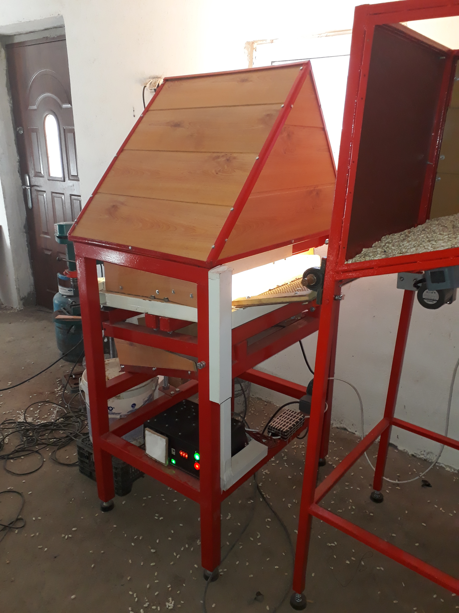

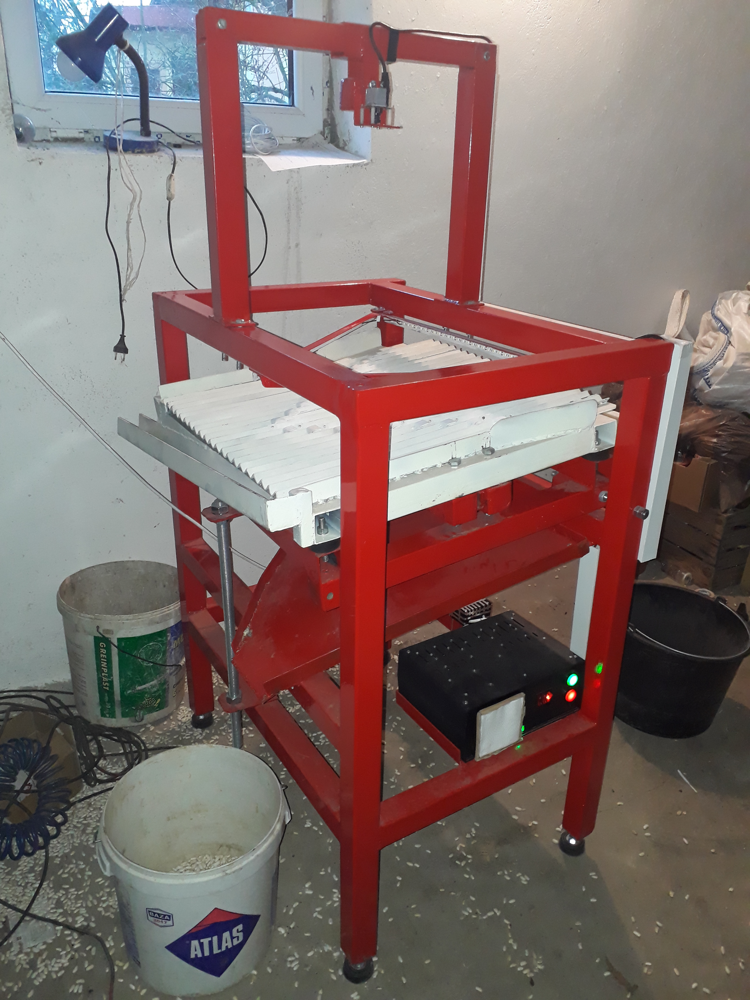
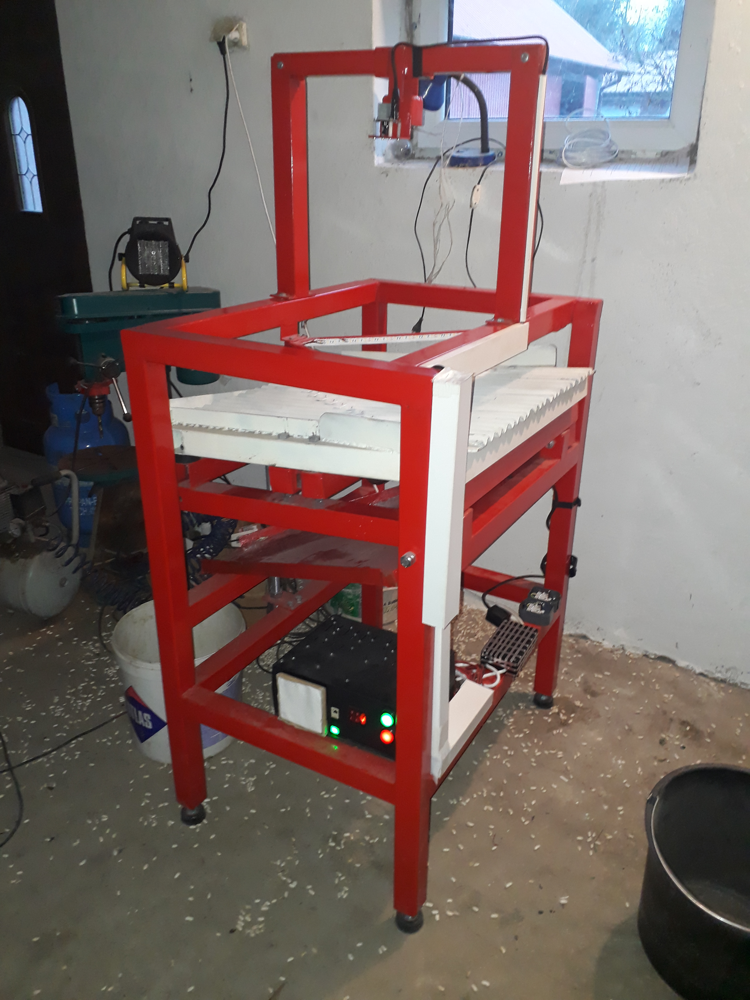
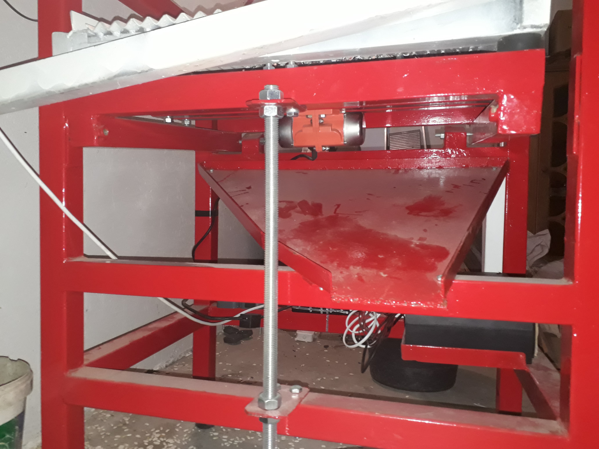

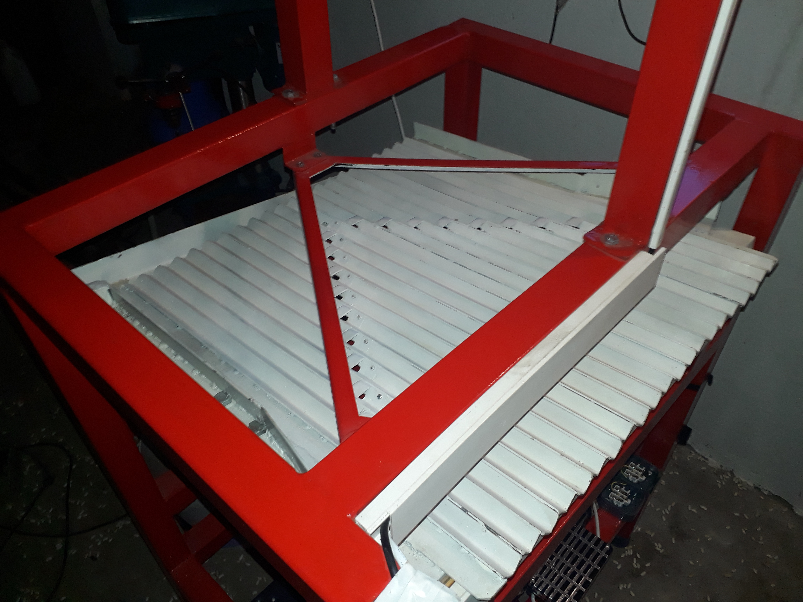

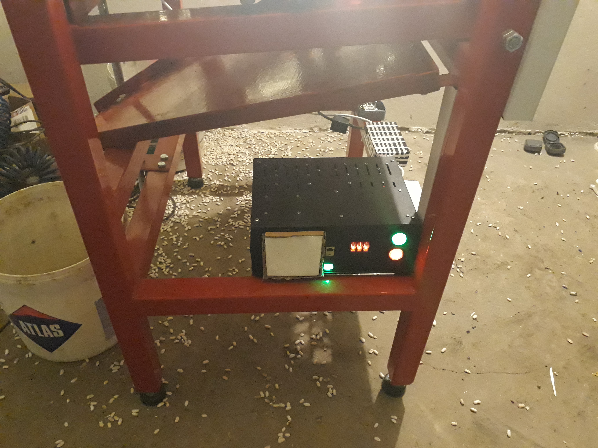
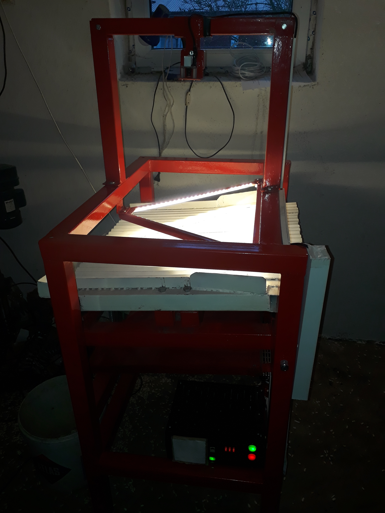
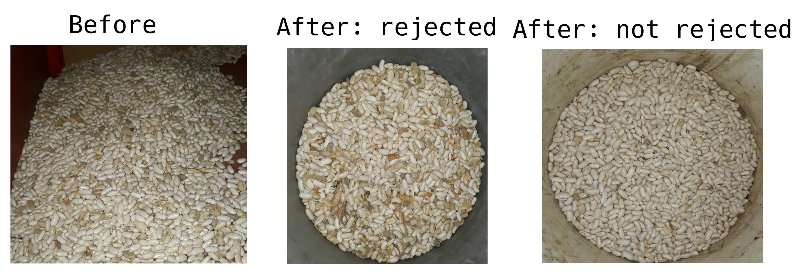

